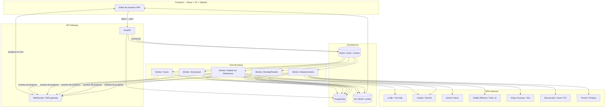

# FÁBRICA DE VÍDEOS — Diseño Técnico Completo

Confirmé el flujo contra los fotogramas del vídeo de referencia que subiste: el pipeline numerado (Referencia → Guion → Voz y Tiempos → Plan Visual → Abastecimiento → Montaje), los contadores de planos por tipo (gráfico/archivo/IA/error) y el paso de "Conseguir material" con reintentos coinciden con lo que describe tu documento. El diseño de abajo está construido sobre esa base.

---

## 1. Diagrama de arquitectura



**Flujo de datos resumido:** el frontend nunca llama directamente a una API de IA; todo pasa por FastAPI, que valida, descuenta créditos y encola un job en Redis. Un worker de Celery lo recoge, llama a la API externa correspondiente, escribe el resultado en Postgres (columna `jsonb` del proyecto) o en S3 (si es un binario), y publica un evento de progreso que el gateway WebSocket reenvía al cliente. Esto desacopla la duración real de cada llamada de IA (segundos a minutos) del ciclo de vida de una petición HTTP.

---

## 2. Estructura de base de datos

Se amplía el modelo del documento original con tablas necesarias para reparto de voces, transacciones de crédito y trazabilidad de jobs (imprescindible para reintentos y para depurar por qué un plano quedó "con error", como se ve en el paso de Abastecimiento).

```sql
-- Usuarios
CREATE TABLE users (
    id UUID PRIMARY KEY DEFAULT gen_random_uuid(),
    email VARCHAR(255) UNIQUE NOT NULL,
    hashed_password VARCHAR(255),
    oauth_provider VARCHAR(50),
    api_key VARCHAR(255),
    credits INTEGER NOT NULL DEFAULT 0,
    plan VARCHAR(20) NOT NULL DEFAULT 'free', -- free | pro | enterprise
    created_at TIMESTAMPTZ NOT NULL DEFAULT now()
);

-- Proyectos (el núcleo del dominio)
CREATE TABLE projects (
    id UUID PRIMARY KEY DEFAULT gen_random_uuid(),
    user_id UUID NOT NULL REFERENCES users(id) ON DELETE CASCADE,
    title VARCHAR(500) NOT NULL,
    description TEXT,
    format VARCHAR(30) NOT NULL, -- longform_9_16 | shortform_9_16 | horizontal_16_9
    target_duration_seconds INTEGER NOT NULL,
    actual_duration_seconds NUMERIC(8,2),
    status VARCHAR(30) NOT NULL DEFAULT 'draft',
    -- draft | analyzing | scripting | storyboarding | provisioning | rendering | completed | failed
    reference_url TEXT,
    reference_analysis JSONB,
    script JSONB,           -- array de bloques {id, text, order, estimated_seconds}
    voice_selection JSONB,  -- {voice_id, speed, language}
    storyboard JSONB,       -- array de planos {id, description, shot_type, source, duration_s, asset_id}
    graphics_style VARCHAR(30), -- neon | ambar | bloque | cine (visto en el vídeo de referencia)
    final_video_url TEXT,
    error_message TEXT,
    created_at TIMESTAMPTZ NOT NULL DEFAULT now(),
    updated_at TIMESTAMPTZ NOT NULL DEFAULT now()
);
CREATE INDEX idx_projects_user_status ON projects(user_id, status);

-- Assets generados o abastecidos (una fila por plano resuelto)
CREATE TABLE assets (
    id UUID PRIMARY KEY DEFAULT gen_random_uuid(),
    project_id UUID NOT NULL REFERENCES projects(id) ON DELETE CASCADE,
    storyboard_item_id VARCHAR(50) NOT NULL, -- referencia al id dentro del jsonb storyboard
    type VARCHAR(20) NOT NULL,   -- image | video | audio | subtitle
    source VARCHAR(20) NOT NULL, -- library | stock | ai_generated | upload
    status VARCHAR(20) NOT NULL DEFAULT 'pending', -- pending | ready | error
    url TEXT,
    duration_seconds NUMERIC(6,2),
    provider VARCHAR(50), -- pexels | kling | elevenlabs | stable-diffusion...
    metadata JSONB,        -- resolución, codec, seed, prompt usado, coste en créditos
    error_message TEXT,
    created_at TIMESTAMPTZ NOT NULL DEFAULT now()
);
CREATE INDEX idx_assets_project ON assets(project_id);

-- Voces disponibles para el reparto
CREATE TABLE voices (
    id UUID PRIMARY KEY DEFAULT gen_random_uuid(),
    provider VARCHAR(30) NOT NULL, -- elevenlabs | azure
    provider_voice_id VARCHAR(100) NOT NULL,
    name VARCHAR(100) NOT NULL,
    gender VARCHAR(10),
    language VARCHAR(10),
    tone VARCHAR(30), -- formal | coloquial | narrativo
    sample_url TEXT
);

-- Jobs de cola (auditoría y reintentos, no reemplaza a Redis, lo complementa)
CREATE TABLE jobs (
    id UUID PRIMARY KEY DEFAULT gen_random_uuid(),
    project_id UUID NOT NULL REFERENCES projects(id) ON DELETE CASCADE,
    job_type VARCHAR(30) NOT NULL, -- analyze_reference | generate_script | generate_storyboard | provision | render
    status VARCHAR(20) NOT NULL DEFAULT 'queued', -- queued | running | done | failed
    attempts INTEGER NOT NULL DEFAULT 0,
    payload JSONB,
    result JSONB,
    started_at TIMESTAMPTZ,
    finished_at TIMESTAMPTZ,
    created_at TIMESTAMPTZ NOT NULL DEFAULT now()
);
CREATE INDEX idx_jobs_project_type ON jobs(project_id, job_type);

-- Movimientos de crédito (para trazabilidad de gasto, no solo el saldo actual)
CREATE TABLE credit_transactions (
    id UUID PRIMARY KEY DEFAULT gen_random_uuid(),
    user_id UUID NOT NULL REFERENCES users(id) ON DELETE CASCADE,
    project_id UUID REFERENCES projects(id) ON DELETE SET NULL,
    amount INTEGER NOT NULL, -- negativo = consumo, positivo = recarga
    reason VARCHAR(50) NOT NULL, -- script_generation | asset_generation | render | topup
    created_at TIMESTAMPTZ NOT NULL DEFAULT now()
);
```

**Por qué `jsonb` para `script` y `storyboard`:** ambos son documentos jerárquicos con forma variable (número de bloques, atributos opcionales) que se leen y escriben siempre completos desde el editor. Modelarlos como tablas relacionales normalizadas obligaría a N queries por autoguardado; `jsonb` con índices GIN si hace falta buscar dentro es más simple y suficientemente rápido a esta escala. `assets` sí es tabla propia porque cada fila tiene su propio ciclo de vida asíncrono (pending → ready/error) que se actualiza de forma independiente al documento del proyecto.

---

## 3. Endpoints de API

Base: `/api/v1`. Autenticación: `Authorization: Bearer <JWT>` en todas las rutas salvo `/auth/*`.

### 3.1 Proyectos

**`POST /api/v1/projects`**
```json
// Request
{
  "title": "Todas las consolas de Nintendo, explicadas en 7 minutos",
  "description": "Tono ágil tipo ranking, un dato concreto por consola, cero relleno",
  "format": "horizontal_16_9",
  "target_duration_seconds": 420,
  "reference_url": "https://youtube.com/watch?v=..."
}
// Response 201
{
  "id": "9c1e...",
  "status": "draft",
  "created_at": "2026-09-08T10:00:00Z"
}
```

**`GET /api/v1/projects/{id}`** → devuelve el proyecto completo (incluye `script`, `storyboard`, `reference_analysis` si ya existen).

**`PUT /api/v1/projects/{id}`** → actualiza metadatos (título, descripción, formato, duración objetivo).

### 3.2 Pipeline de generación

**`POST /api/v1/projects/{id}/analyze-reference`**
```json
// Request
{ "reference_url": "https://youtube.com/watch?v=..." }
// Response 202 (async)
{ "job_id": "a1b2...", "status": "queued" }
```
Resultado final (consultable en `GET /projects/{id}` o por WebSocket):
```json
{
  "reference_analysis": {
    "summary": "Ranking rápido con un dato duro por elemento, gancho en los primeros 3s",
    "avg_shot_seconds": 5.9,
    "total_shots": 70,
    "structure": [
      { "block": "gancho", "seconds": 8 },
      { "block": "desarrollo", "seconds": 300 },
      { "block": "cierre", "seconds": 12 }
    ]
  }
}
```

**`POST /api/v1/projects/{id}/generate-script`**
```json
// Response 202
{ "job_id": "c3d4...", "status": "queued" }
```
Resultado:
```json
{
  "script": [
    { "id": "b1", "order": 1, "text": "Muchos recuerdan la mochila del colegio...", "estimated_seconds": 22 },
    { "id": "b2", "order": 2, "text": "Dos mil uno también, GameCube...", "estimated_seconds": 25 }
  ]
}
```

**`PUT /api/v1/projects/{id}/script`** → guarda edición manual del usuario (mismo shape que arriba).

**`POST /api/v1/projects/{id}/generate-storyboard`**
Resultado:
```json
{
  "storyboard": [
    {
      "id": "s1", "order": 1,
      "description": "Titular '1977' en tipografía grande sobre fondo negro",
      "shot_type": "graphic",
      "source": "ai_generated",
      "duration_seconds": 4.5
    },
    {
      "id": "s2", "order": 2,
      "description": "Consola Game Boy y variantes sobre mesa",
      "shot_type": "stock",
      "source": "library",
      "duration_seconds": 3.9
    }
  ]
}
```

**`PUT /api/v1/projects/{id}/storyboard`** → guarda cambios manuales (p. ej. el usuario cambia `source` de un plano de `ai_generated` a `library`).

**`POST /api/v1/projects/{id}/provision`** → dispara la resolución de todos los planos pendientes.
```json
// Response 202
{ "job_id": "e5f6...", "queued_items": 107 }
```

**`POST /api/v1/projects/{id}/render`** → monta el vídeo final una vez todos los assets están `ready`.
```json
// Response 202
{ "job_id": "g7h8..." }
// Response 409 si aún hay assets pendientes
{ "error": "assets_not_ready", "pending": 3 }
```

**`GET /api/v1/projects/{id}/status`** → snapshot de progreso (también disponible por WS/SSE en `/ws/projects/{id}`).
```json
{
  "status": "provisioning",
  "assets_ready": 106,
  "assets_total": 107,
  "assets_error": 1
}
```

### 3.3 Auxiliares

- `GET /api/v1/voices?language=es&tone=coloquial` → lista de voces con `sample_url`.
- `POST /api/v1/credits/check` → `{ "action": "render", "estimated_cost": 10 }` → `{ "sufficient": true, "balance": 340 }`.
- `DELETE /api/v1/projects/{id}`.

---

## 4. Workers y comunicación con la cola

Cola: **Celery + Redis** (broker y backend de resultados). Cada endpoint de pipeline solo valida, crea una fila en `jobs`, publica el mensaje en la cola correspondiente y responde `202` con el `job_id`; nunca ejecuta la tarea de IA en el request-response.

| Worker | Cola dedicada | Entrada | Salida | Reintentos |
|---|---|---|---|---|
| Análisis de referencia | `queue.reference` | `reference_url` | `reference_analysis` (jsonb) | 2, backoff exponencial (fallos de descarga de YouTube) |
| Generación de guion | `queue.script` | título + descripción + `reference_analysis` | `script` (jsonb) | 3 (rate limits del LLM) |
| Storyboard | `queue.storyboard` | `script` | `storyboard` (jsonb) | 2 |
| Abastecimiento | `queue.provision` (concurrencia alta, un job por plano) | un ítem de `storyboard` | fila en `assets` con `status=ready\|error` | 3 por plano, luego se marca `error` sin bloquear el resto |
| Montaje/Render | `queue.render` (cola separada, baja concurrencia, CPU-bound) | `storyboard` + `assets` + `voice_selection` | `final_video_url` | 1 manual (el render es caro; un fallo se reporta y se deja para reintento explícito del usuario) |

**Por qué el worker de Abastecimiento va plano-por-plano y no proyecto-por-proyecto:** con 100+ planos por vídeo, tratar el abastecimiento como un job atómico significa que un solo plano fallido tumba los otros 106 ya listos. Descomponerlo en un job por plano permite exactamente el comportamiento que se ve en el vídeo de referencia ("106/107 listos · 1 con error"): el resto avanza y el usuario decide si reintenta, cambia de fuente o ignora ese plano.

**Progreso en tiempo real:** cada worker publica en un canal Redis Pub/Sub (`project:{id}:events`) al empezar y terminar cada unidad de trabajo; un proceso ligero de FastAPI (o un segundo servicio) se suscribe y reenvía por WebSocket a los clientes conectados a ese proyecto. Esto evita polling desde el frontend.

---

## 5. Mockup de interfaz

Contrastado con el vídeo de referencia, la pantalla del editor se organiza en una columna izquierda de configuración fija y un timeline vertical de pasos numerados:

- **Cabecera de proyecto:** título editable, badges con formato (`16:9`), duración objetivo (`7 MIN OBJETIVO`), duración real estimada (`05:39 REALES`) y nº de planos (`107 PLANOS`).
- **Instrucciones para este vídeo:** textarea colapsable ("opcional — tono, qué evitar, qué destacar, manías tuyas").
- **Timeline de pasos (1 a 6), cada uno como tarjeta con estado:**
  1. **Referencia** — resumen de línea: "7 min · un plano cada 5,9 s · 70 escenas leídas".
  2. **Guion** — bloques de texto editables en línea, botón **Reescribir** con selector de minutos objetivo, contador de palabras.
  3. **Voz y tiempos** — selector de voz con preview de audio, minutos y nº de palabras calculado.
  4. **Plan visual** — descripción de qué se ve en cada plano, tipo y duración; requiere aprobación explícita antes de pasar al siguiente paso ("se aprueba antes de gastar").
  5. **Abastecimiento** — selector de estilo gráfico (chips: Neón / Ámbar / Bloque / Cine), botón **Conseguir material**, contador `106/107 listos · 1 con error`.
  6. **Montaje** — duración final consolidada, botón de exportación.
- **Grid de planos (debajo del timeline):** filtros por tipo (`todos 107`, `gráfico 51`, `archivo 23`, `IA 24`, `internet 9`, `error 1`), cada tarjeta con miniatura, número de orden, texto asociado y duración; clic para reabrir/regenerar ese plano individual.
- **Panel "Tus vídeos":** grid de proyectos con miniatura, estado (badge de color) y acciones rápidas (editar, duplicar, descargar, eliminar).

---

## 6. Plan de integración con APIs externas

| Integración | Uso | Notas de implementación |
|---|---|---|
| **Claude / Gemini (LLM)** | Guion y descripciones de plano | Prompt con: título, descripción/ángulo, `reference_analysis`, duración objetivo y nº de bloques esperado. Pedir salida JSON estructurada (bloques con `order` y `estimated_seconds`) para evitar parsing frágil. |
| **Gemini Vision + OpenCV** | Análisis del vídeo de referencia | `yt-dlp` descarga el vídeo a un volumen temporal; se extraen frames con OpenCV cada N segundos y se detectan cortes de plano por diferencia de histograma; Gemini Vision describe cada frame clave para construir el resumen textual. |
| **Stable Diffusion / DALL-E, Kling / Runway / Veo** | Generación de imagen/vídeo por plano | Encapsular detrás de una interfaz común `ImageProvider` / `VideoProvider` para poder cambiar de proveedor sin tocar el worker de abastecimiento; guardar el prompt usado en `assets.metadata` para poder regenerar. |
| **ElevenLabs / Azure TTS** | Locución | Generar por bloque de guion (no todo el audio de una vez) para poder resincronizar si el usuario edita un bloque sin regenerar todo. |
| **Pexels / Pixabay** | Material de stock | Búsqueda por palabras clave extraídas del bloque de guion correspondiente; cachear resultados de búsqueda por hash de la query. |
| **FFmpeg** | Montaje final | `fluent-ffmpeg` o subprocess directo; pipeline: concatenar clips → overlay de subtítulos (`drawtext`/ASS) → mezclar pista de voz + música de fondo con *ducking* → exportar H.264 1080p (o 1080×1920 para shortform). |

Todas las llamadas a proveedores externos pasan por una capa de servicio con **rate limiting propio** (token bucket en Redis) para no saturar los límites de cada API y para poder aplicar backoff antes de que el proveedor devuelva 429.

---

## 7. Consideraciones de seguridad

- **Autenticación:** JWT de corta duración (15 min) + refresh token httpOnly, más OAuth2 con Google como alternativa de registro. Nunca se guarda contraseña en texto plano (bcrypt/argon2).
- **Claves de API de terceros:** viven solo en el backend (variables de entorno / secret manager tipo AWS Secrets Manager o Vault), nunca se exponen al frontend. Si un usuario aporta su propia API key (campo `api_key` en `users`), se cifra en reposo (AES-256) y se descifra solo en memoria del worker que la usa.
- **Validación de entrada:** todos los payloads validados con Pydantic (título/descr. con límites de longitud, `reference_url` restringida a dominios de YouTube conocidos para evitar SSRF vía `yt-dlp`).
- **SSRF y descargas:** el worker que llama a `yt-dlp` corre en un contenedor aislado sin acceso a la red interna (solo salida a internet), con timeout y límite de tamaño de descarga.
- **Aislamiento por usuario:** todas las queries de proyectos/assets filtran por `user_id` a nivel de servicio (no confiar solo en el `id` del recurso en la URL) — mitiga IDOR.
- **Rate limiting de API propia:** por usuario y por IP en los endpoints que disparan trabajo costoso (`generate-script`, `render`), para evitar abuso incluso con créditos suficientes.
- **Contenido generado:** dado que hay generación de imagen/vídeo por IA, conviene un filtro de moderación (p. ej. moderación de prompts antes de enviarlos al proveedor) para evitar contenido no permitido por los términos de esos proveedores.
- **Almacenamiento:** URLs de S3 firmadas con expiración corta para descarga; los buckets no son públicos por defecto.

---

## 8. Estrategia de implementación

| Fase | Contenido | Estimación* |
|---|---|---|
| **1. Base** | Frontend estático (paneles de configuración), CRUD de proyectos, auth JWT/OAuth, esquema de BD inicial | 2–3 semanas |
| **2. Referencia + Guion** | Integración `yt-dlp` + Gemini Vision + OpenCV; worker de guion con LLM; edición de guion en frontend; WebSocket de progreso | 3–4 semanas |
| **3. Storyboard + Abastecimiento** | Worker de storyboard; integración de proveedores de imagen/vídeo y stock; grid de planos con filtros y reintento individual | 4–5 semanas |
| **4. Montaje + Exportación** | Integración FFmpeg, TTS por bloque, sincronización de subtítulos, export a S3, reproductor de preview | 3–4 semanas |
| **5. Créditos, escalado y pulido** | Sistema de créditos/planes, caché de análisis repetidos, escalado horizontal de workers, monitoreo (Langfuse + Prometheus/Grafana) | 2–3 semanas |

\* Estimaciones para un equipo pequeño (2–3 devs full-stack); las fases 2 a 4 pueden solaparse parcialmente una vez el modelo de datos y la cola de trabajos del backend están estables.

---

### Notas finales

- El punto de mayor riesgo técnico no es la integración de IA en sí, sino la **orquestación de estados parciales**: un proyecto puede tener guion aprobado, la mitad del storyboard abastecido y el resto fallando. El modelo de datos y los workers de arriba están pensados para que ese estado intermedio sea siempre representable y recuperable (reintentar un plano, no todo el proyecto).
- Si el backend de esta app se apoya en LiteLLM para abstraer Claude/Gemini (como en tus otros proyectos), la capa `LLM` de este diseño encaja directamente como un cliente más detrás de esa misma configuración, sin necesitar un stack distinto para el guion.
